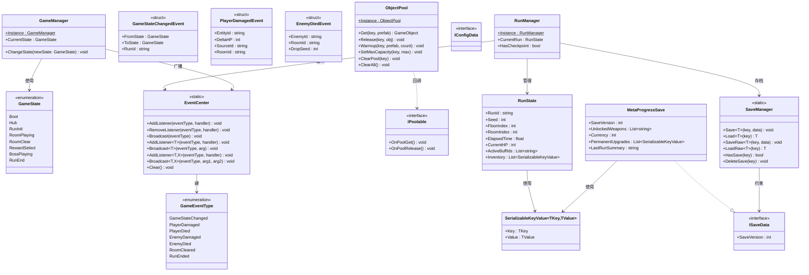
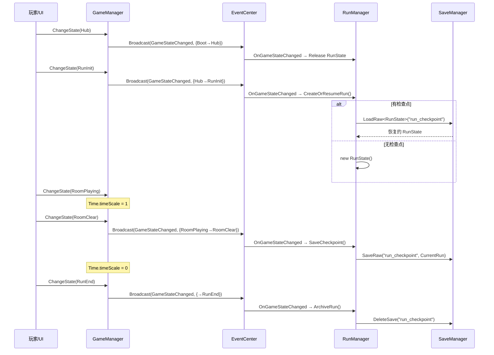
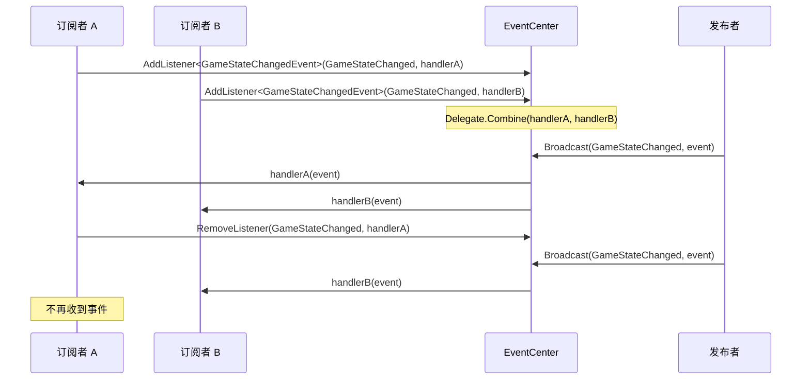
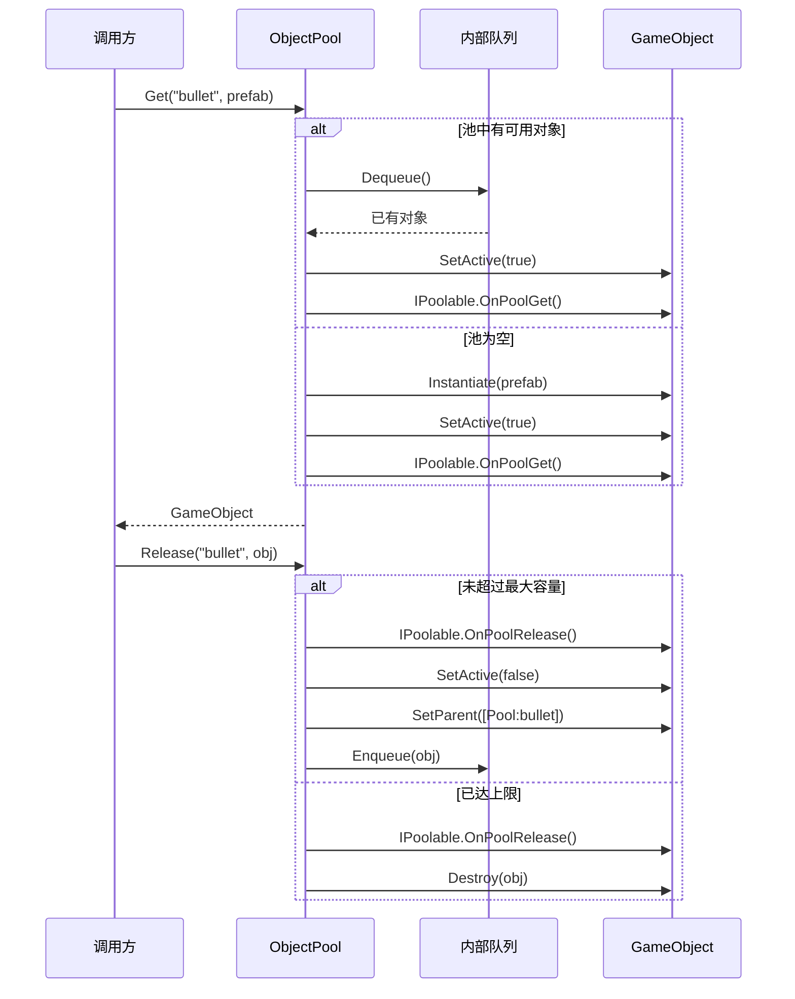
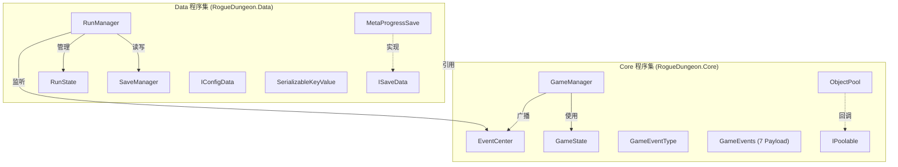

# 2D Roguelike Dungeon

Unity 2D Roguelike 地牢游戏 — 核心基础架构。

## 目录

- [项目结构](#项目结构)
- [架构概览](#架构概览)
- [类图](#类图)
- [时序图](#时序图)
- [模块依赖](#模块依赖)
- [API 参考与使用说明](#api-参考与使用说明)
  - [GameManager 状态机](#gamemanager-状态机)
  - [EventCenter 事件中心](#eventcenter-事件中心)
  - [ObjectPool 对象池](#objectpool-对象池)
  - [SaveManager 存档管理](#savemanager-存档管理)
  - [RunManager 单局生命周期](#runmanager-单局生命周期)
- [测试](#测试)

---

## 项目结构

```
Assets/Scripts/
├── Core/                          # 核心层（无外部依赖）
│   ├── Core.asmdef                # RogueDungeon.Core 程序集
│   ├── GameState.cs               # 8 状态枚举
│   ├── GameManager.cs             # 状态机单例
│   ├── Events/
│   │   ├── EventType.cs           # GameEventType 枚举（7 种）
│   │   ├── EventCenter.cs         # 事件中心（静态类）
│   │   └── GameEvents.cs          # 7 个事件 Payload 结构体
│   └── Pool/
│       ├── IPoolable.cs           # 池化对象接口
│       └── ObjectPool.cs          # 对象池单例
│
└── Data/                          # 数据层（依赖 Core）
    ├── Data.asmdef                # RogueDungeon.Data 程序集
    ├── SerializableKeyValue.cs    # 泛型键值对（替代 Dictionary）
    ├── Config/
    │   └── IConfigData.cs         # 只读配置标记接口
    ├── Runtime/
    │   ├── RunState.cs            # 单局运行时状态
    │   └── RunManager.cs          # Run 生命周期管理单例
    └── Save/
        ├── ISaveData.cs           # 存档数据接口（含版本号）
        ├── MetaProgressSave.cs    # 元成长存档
        └── SaveManager.cs         # 存档管理器（静态类）
```

## 架构概览

采用 **Core + Data 双层架构**，遵循 Config → Runtime → Save **单向数据流**：

| 层级 | 职责 | 生命周期 |
|------|------|---------|
| **Config** | 静态配置（武器表、敌人表等） | 全局 |
| **Runtime** | 单局运行时状态（`RunState`） | 单局 Run |
| **Save** | 持久化存档（`MetaProgressSave`） | 永久 |

三个 MonoBehaviour **单例**跨场景存活：
- `GameManager` — 全局状态机
- `ObjectPool` — 全局对象池
- `RunManager` — 单局生命周期管理

---

## 类图



---

## 时序图

### 完整 Run 生命周期



### 事件订阅与广播



### 对象池 Get/Release 流程



---

## 模块依赖



**依赖规则**：`Core` 无任何外部依赖 → `Data` 单向引用 `Core` → 不允许反向依赖。

---

## API 参考与使用说明

### GameManager 状态机

8 个游戏状态通过**白名单迁移矩阵**控制合法转换。

```csharp
// 切换状态
GameManager.Instance.ChangeState(GameState.RunInit);

// 读取当前状态
GameState current = GameManager.Instance.CurrentState;
```

**迁移矩阵**（→ 表示合法迁移）：

| 当前状态 | 可迁移至 |
|---------|---------|
| Boot | → Hub |
| Hub | → RunInit |
| RunInit | → RoomPlaying |
| RoomPlaying | → RoomClear, BossPlaying, RunEnd |
| RoomClear | → RewardSelect |
| RewardSelect | → RoomPlaying |
| BossPlaying | → RunEnd |
| RunEnd | → Hub |

**timeScale 规则**：`Hub`/`RoomPlaying`/`BossPlaying` → 1，其他 → 0

---

### EventCenter 事件中心

基于 `Dictionary<GameEventType, Delegate>` 的类型化事件系统。

```csharp
using RogueDungeon.Core.Events;

// ---- 无参事件 ----
EventCenter.AddListener(GameEventType.RoomCleared, OnRoomCleared);
EventCenter.RemoveListener(GameEventType.RoomCleared, OnRoomCleared);

void OnRoomCleared() { Debug.Log("房间清空！"); }

// ---- 泛型事件（推荐） ----
EventCenter.AddListener<GameStateChangedEvent>(
    GameEventType.GameStateChanged, OnStateChanged);

void OnStateChanged(GameStateChangedEvent e)
{
    Debug.Log($"状态: {e.FromState} → {e.ToState}");
}

// ---- 广播 ----
EventCenter.Broadcast(GameEventType.GameStateChanged,
    new GameStateChangedEvent
    {
        FromState = GameState.Hub,
        ToState = GameState.RunInit,
        RunId = "run_001"
    });
```

**重要规则**：
- 同一 `GameEventType` **只允许注册一种委托类型**，类型冲突抛出 `InvalidOperationException`
- 在 `OnEnable` 中订阅，`OnDisable` 中退订
- 场景卸载时自动清除所有订阅（`DontDestroyOnLoad` 对象需在 `OnEnable` 重新注册）
- 单个 handler 异常不会中断广播链

**7 种事件 Payload**：

| 事件 | 字段 |
|------|------|
| `GameStateChangedEvent` | `FromState`, `ToState`, `RunId` |
| `PlayerDamagedEvent` | `EntityId`, `DeltaHP`, `SourceId`, `RoomId` |
| `PlayerDiedEvent` | `EntityId`, `RoomId`, `RunId` |
| `EnemyDamagedEvent` | `EnemyId`, `DeltaHP`, `SourceId`, `RoomId` |
| `EnemyDiedEvent` | `EnemyId`, `RoomId`, `DropSeed` |
| `RoomClearedEvent` | `RoomId`, `ElapsedTime` |
| `RunEndedEvent` | `RunId`, `IsVictory`, `Floor`, `RewardSummary` |

---

### ObjectPool 对象池

MonoBehaviour 单例，支持按 key 分池、IPoolable 回调、每键最大容量。

```csharp
using RogueDungeon.Core.Pool;

// 预热 10 个子弹
ObjectPool.Instance.Warmup("bullet", bulletPrefab, 10);

// 设置最大容量（默认 64）
ObjectPool.Instance.SetMaxCapacity("bullet", 32);

// 从池获取
GameObject bullet = ObjectPool.Instance.Get("bullet", bulletPrefab);

// 回收入池
ObjectPool.Instance.Release("bullet", bullet);

// 清理
ObjectPool.Instance.ClearPool("bullet"); // 清理单个 key
ObjectPool.Instance.ClearAll();           // 清理全部
```

**IPoolable 接口**（可选）：

```csharp
public class Bullet : MonoBehaviour, IPoolable
{
    public void OnPoolGet()
    {
        // 重置状态：速度、方向等
        GetComponent<Rigidbody2D>().linearVelocity = Vector2.zero;
    }

    public void OnPoolRelease()
    {
        // 清理：停止粒子、重置计时器等
    }
}
```

**场景层级**：每个 key 有独立容器 Transform（`[Pool:bullet]`、`[Pool:enemy]`）。

---

### SaveManager 存档管理

静态类，使用 `JsonUtility` + `Application.persistentDataPath`。

```csharp
using RogueDungeon.Data.Save;

// ---- ISaveData 存档（含版本校验） ----
var meta = new MetaProgressSave();
meta.Currency = 500;
SaveManager.Save("meta_progress", meta);

var loaded = SaveManager.Load<MetaProgressSave>("meta_progress");
// 若版本不匹配 → LogWarning + 返回默认值

// ---- 通用存档（无版本约束） ----
SaveManager.SaveRaw("run_checkpoint", runState);
var restored = SaveManager.LoadRaw<RunState>("run_checkpoint");

// ---- 工具方法 ----
bool exists = SaveManager.HasSave("meta_progress");
SaveManager.DeleteSave("run_checkpoint");
```

**版本校验**：`Load<T>` 会比对文件中的 `SaveVersion` 与 `new T().SaveVersion`，不匹配则返回默认值并 LogWarning。

> **注意**：`JsonUtility` 不支持序列化 `Dictionary`，请使用 `List<SerializableKeyValue<K,V>>` 替代。

---

### RunManager 单局生命周期

自动监听 `GameStateChanged` 事件，管理 `RunState` 创建、检查点、归档。

```csharp
using RogueDungeon.Data.Runtime;

// 读取当前 Run 状态（仅在 RunInit ~ RunEnd 期间有效）
RunState run = RunManager.Instance.CurrentRun;
Debug.Log($"当前层: {run.FloorIndex}, HP: {run.CurrentHP}");

// 检查是否有中途存档
bool canResume = RunManager.Instance.HasCheckpoint;
```

**自动行为**（无需手动调用）：

| GameState 事件 | RunManager 动作 |
|---------------|----------------|
| → `RunInit` | 创建新 RunState 或从检查点恢复 |
| → `RoomClear` | 保存检查点到文件 |
| → `RunEnd` | 归档本局结果 + 删除检查点 |
| → `Hub` | 释放 RunState 引用 |

---

## 测试

46 个 EditMode 单元测试，覆盖所有核心系统：

| 测试文件 | 测试数量 | 覆盖范围 |
|---------|---------|---------|
| `EventCenterTests.cs` | 10 | 三种委托、类型冲突、异常隔离、Clear |
| `GameManagerTests.cs` | 9 | 状态迁移、非法路径、timeScale、事件广播 |
| `ObjectPoolTests.cs` | 10 | Get/Release/Warmup/IPoolable/容器/容量 |
| `SaveManagerTests.cs` | 11 | Save/Load/版本校验/SaveRaw/SerializableKeyValue |
| **合计** | **46** | |

运行测试：在 Unity Editor 中打开 **Window → General → Test Runner → EditMode → Run All**。
