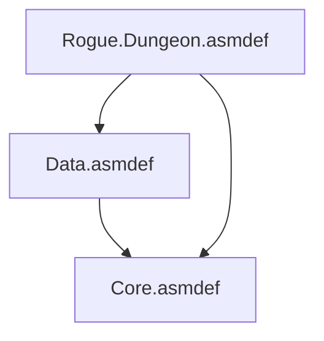
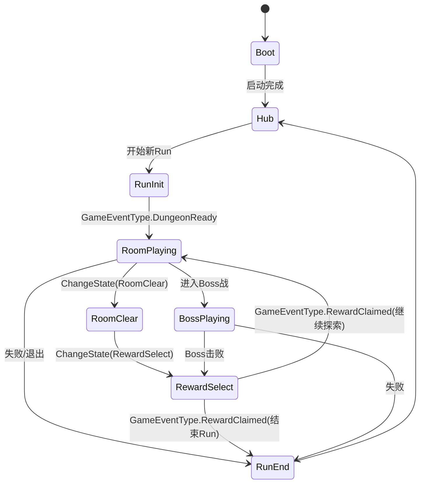
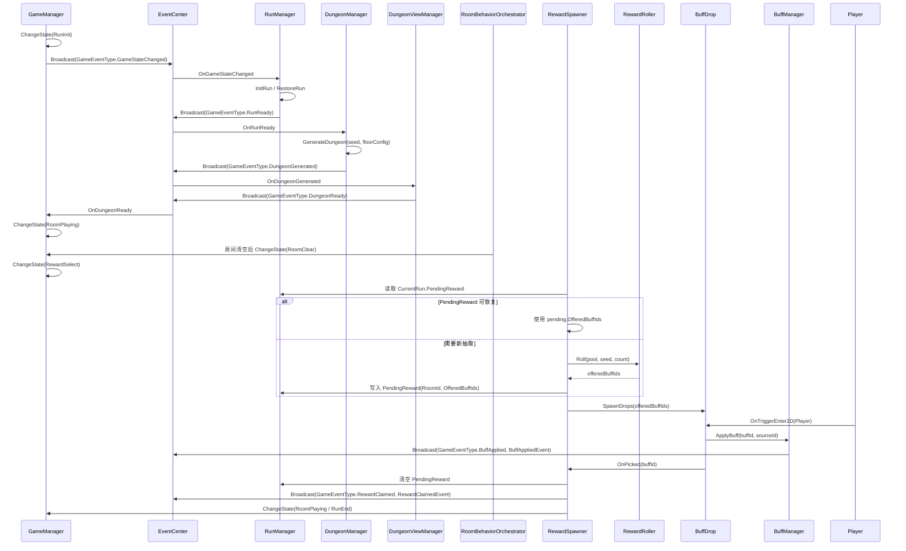
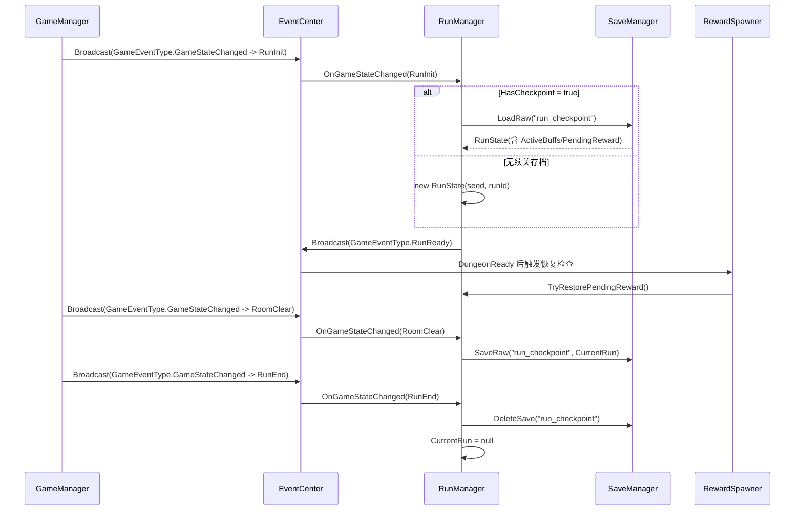

# 2D Roguelike Dungeon

Unity 2D Roguelike 地牢项目（Unity **2022.3.62f3c1**）。

本 README 按当前代码的模块划分，重写为“项目结构导向”版本。

## 目录（TOC）

- [模块划分（Scripts）](#模块划分scripts)
- [项目结构（简化）](#项目结构简化)
- [关键依赖关系（asmdef）](#关键依赖关系asmdef)
- [模块依赖图（编译期）](#模块依赖图编译期)
- [流程图总览](#流程图总览)
- [状态跳转图（GameState）](#状态跳转图gamestate)
- [主时序图（Run 到 RewardClaimed）](#主时序图run-到-rewardclaimed)
- [存档与恢复时序图（RunState）](#存档与恢复时序图runstate)
- [常用入口文件索引](#常用入口文件索引)
- [启动到奖励结算导航顺序（按入口跳转）](#启动到奖励结算导航顺序按入口跳转)
- [建议阅读顺序（新人上手）](#建议阅读顺序新人上手)
- [测试与规格文档位置](#测试与规格文档位置)

---

## 模块划分（Scripts）

| 模块 | 目录 | 职责 |
|---|---|---|
| Core | `Assets/Scripts/Core` | 全局状态机、事件中心、基础枚举、对象池 |
| Data | `Assets/Scripts/Data` | Run 运行态、Buff 运行态、配置 SO、存档 |
| Rogue.Dungeon | `Assets/Scripts/Rogue/Dungeon` | 地牢生成、地图运行态、房间视图、奖励掉落 |
| Debug | `Assets/Scripts/Debug` | 运行时调试启动、房间清理探针、移动诊断 |
| UI | `Assets/Scripts/UI` | 启动面板等 UI 入口 |

---

## 项目结构（简化）

```text
.
├─ Assets/
│  ├─ Scenes/                      # 场景资源（如 PatrickStarTest）
│  ├─ Scripts/
│  │  ├─ Core/                    # 状态机、事件、对象池、Buff基础枚举
│  │  ├─ Data/                    # Run/Buff运行态、配置、存档
│  │  ├─ Rogue/Dungeon/
│  │  │  ├─ Data/
│  │  │  ├─ Generation/
│  │  │  ├─ Runtime/
│  │  │  ├─ View/
│  │  │  └─ Reward/
│  │  ├─ Debug/
│  │  └─ UI/
│  ├─ Data/Buff/                  # BuffPool 与 Buff 配置资源
│  ├─ Prefabs/                    # FloorSO / RoomTemplate / Reward
│  ├─ Tests/EditMode/             # 主要自动化测试目录
│  └─ 美术音频资源目录（Tiles/TMP/...）
├─ Packages/
│  ├─ manifest.json               # Unity 包声明
│  └─ packages-lock.json
├─ ProjectSettings/
├─ openspec/                      # 规格与评审记录（被 .gitignore 忽略）
│  ├─ specs/
│  ├─ references/
│  └─ changes/archive/
└─ README.md
```

---

## 关键依赖关系（asmdef）

1. `Core` 不依赖 `Data`、`Rogue.Dungeon`
2. `Data` 依赖 `Core`
3. `Rogue.Dungeon` 依赖 `Core` + `Data`

---

## 模块依赖图（编译期）



---

## 流程图总览

| 图示 | 关注点 | 快速入口 |
|---|---|---|
| 状态跳转图 | GameState 合法迁移与奖励阶段切换 | [跳转](#状态跳转图gamestate) |
| 主时序图 | 从 RunInit 到 RewardClaimed 的主链路 | [跳转](#主时序图run-到-rewardclaimed) |
| 存档恢复图 | `run_checkpoint` 的保存、加载、清理 | [跳转](#存档与恢复时序图runstate) |

---

## 状态跳转图（GameState）



---

## 主时序图（Run 到 RewardClaimed）



---

## 存档与恢复时序图（RunState）



---

## 常用入口文件索引

| 入口 | 路径 | 说明 |
|---|---|---|
| GameManager | [Assets/Scripts/Core/GameManager.cs](Assets/Scripts/Core/GameManager.cs) | 全局状态切换与 `GameStateChanged` 广播 |
| EventCenter | [Assets/Scripts/Core/Events/EventCenter.cs](Assets/Scripts/Core/Events/EventCenter.cs) | 统一事件订阅/广播总线 |
| RunManager | [Assets/Scripts/Data/Runtime/RunManager.cs](Assets/Scripts/Data/Runtime/RunManager.cs) | Run 创建/恢复与运行态主入口 |
| BuffManager | [Assets/Scripts/Data/Runtime/BuffManager.cs](Assets/Scripts/Data/Runtime/BuffManager.cs) | Buff 生命周期、叠层、过期、持久化绑定 |
| DungeonManager | [Assets/Scripts/Rogue/Dungeon/DungeonManager.cs](Assets/Scripts/Rogue/Dungeon/DungeonManager.cs) | 地牢生成、房间切换、楼层推进 |
| DungeonGenerator | [Assets/Scripts/Rogue/Dungeon/Generation/DungeonGenerator.cs](Assets/Scripts/Rogue/Dungeon/Generation/DungeonGenerator.cs) | Seed 驱动的地图生成主流程 |
| DungeonViewManager | [Assets/Scripts/Rogue/Dungeon/View/DungeonViewManager.cs](Assets/Scripts/Rogue/Dungeon/View/DungeonViewManager.cs) | 地图视图实例化与可见性初始化 |
| DoorTransitCoordinator | [Assets/Scripts/Rogue/Dungeon/View/DoorTransitCoordinator.cs](Assets/Scripts/Rogue/Dungeon/View/DoorTransitCoordinator.cs) | 门触发转场、传送、输入门控 |
| RoomBehaviorOrchestrator | [Assets/Scripts/Rogue/Dungeon/View/RoomBehaviorOrchestrator.cs](Assets/Scripts/Rogue/Dungeon/View/RoomBehaviorOrchestrator.cs) | 房间进入/清理/退出行为编排 |
| RewardSpawner | [Assets/Scripts/Rogue/Dungeon/Reward/RewardSpawner.cs](Assets/Scripts/Rogue/Dungeon/Reward/RewardSpawner.cs) | 奖励掉落生成、恢复与领取流转 |
| RewardRoller | [Assets/Scripts/Rogue/Dungeon/Reward/RewardRoller.cs](Assets/Scripts/Rogue/Dungeon/Reward/RewardRoller.cs) | 基于 seed 的奖励抽取 |
| BuffDrop | [Assets/Scripts/Rogue/Dungeon/Reward/BuffDrop.cs](Assets/Scripts/Rogue/Dungeon/Reward/BuffDrop.cs) | 掉落实体表现与拾取触发 |

---

## 启动到奖励结算导航顺序（按入口跳转）

1. `GameManager.ChangeState(RunInit)` 触发 `GameEventType.GameStateChanged` → [GameManager.cs](Assets/Scripts/Core/GameManager.cs)
2. `RunManager` 处理 `GameStateChanged` 后广播 `GameEventType.RunReady` → [RunManager.cs](Assets/Scripts/Data/Runtime/RunManager.cs)
3. `DungeonManager` 响应 `RunReady`，调用 `DungeonGenerator.Generate(...)` → [DungeonManager.cs](Assets/Scripts/Rogue/Dungeon/DungeonManager.cs) / [DungeonGenerator.cs](Assets/Scripts/Rogue/Dungeon/Generation/DungeonGenerator.cs)
4. 地图完成后广播 `GameEventType.DungeonGenerated`，由 `DungeonViewManager` 构建视图 → [DungeonViewManager.cs](Assets/Scripts/Rogue/Dungeon/View/DungeonViewManager.cs)
5. 视图就绪后广播 `GameEventType.DungeonReady`，`GameManager` 自动切到 `RoomPlaying` → [GameManager.cs](Assets/Scripts/Core/GameManager.cs)
6. 房间清空路径：`RoomBehaviorOrchestrator` 触发 `RoomClear -> RewardSelect` → [RoomBehaviorOrchestrator.cs](Assets/Scripts/Rogue/Dungeon/View/RoomBehaviorOrchestrator.cs)
7. `RewardSpawner` 进入奖励阶段并执行 `RewardRoller.Roll(...)` → [RewardSpawner.cs](Assets/Scripts/Rogue/Dungeon/Reward/RewardSpawner.cs) / [RewardRoller.cs](Assets/Scripts/Rogue/Dungeon/Reward/RewardRoller.cs)
8. `BuffDrop.OnTriggerEnter2D(Player)` 触发拾取 → [BuffDrop.cs](Assets/Scripts/Rogue/Dungeon/Reward/BuffDrop.cs)
9. Buff 应用后广播 `GameEventType.BuffApplied` → [BuffManager.cs](Assets/Scripts/Data/Runtime/BuffManager.cs)
10. 奖励领取广播 `GameEventType.RewardClaimed`，并切换到 `RoomPlaying` 或 `RunEnd` → [RewardSpawner.cs](Assets/Scripts/Rogue/Dungeon/Reward/RewardSpawner.cs)

---

## 建议阅读顺序（新人上手）

1. [Assets/Scripts/Core/GameState.cs](Assets/Scripts/Core/GameState.cs) — 先理解状态枚举与流程边界。
2. [GameManager.cs](Assets/Scripts/Core/GameManager.cs) + [EventCenter.cs](Assets/Scripts/Core/Events/EventCenter.cs) — 理解状态驱动与事件总线。
3. [RunState.cs](Assets/Scripts/Data/Runtime/RunState.cs) + [RunManager.cs](Assets/Scripts/Data/Runtime/RunManager.cs) — 理解单局运行态与生命周期。
4. [DungeonManager.cs](Assets/Scripts/Rogue/Dungeon/DungeonManager.cs) + [DungeonGenerator.cs](Assets/Scripts/Rogue/Dungeon/Generation/DungeonGenerator.cs) — 理解地牢生成与房间切换主链路。
5. [DungeonViewManager.cs](Assets/Scripts/Rogue/Dungeon/View/DungeonViewManager.cs) + [RoomBehaviorOrchestrator.cs](Assets/Scripts/Rogue/Dungeon/View/RoomBehaviorOrchestrator.cs) — 理解视图初始化、房间行为和门转场。
6. [BuffManager.cs](Assets/Scripts/Data/Runtime/BuffManager.cs) + [RewardSpawner.cs](Assets/Scripts/Rogue/Dungeon/Reward/RewardSpawner.cs) + [BuffDrop.cs](Assets/Scripts/Rogue/Dungeon/Reward/BuffDrop.cs) — 最后看 Buff 与奖励系统接入。

---

## 测试与规格文档位置

- EditMode 自动化：[Assets/Tests/EditMode/](Assets/Tests/EditMode/)
- 奖励系统相关回归：[Assets/Tests/EditMode/Rogue/Dungeon/Reward/](Assets/Tests/EditMode/Rogue/Dungeon/Reward/)
- OpenSpec 主规格：[openspec/specs/](openspec/specs/)
- 评审与测试记录：[openspec/references/20260421/](openspec/references/20260421/)

> 说明：`openspec/` 在仓库 `.gitignore` 中配置为忽略目录，用于本地规格流转与归档记录管理。
