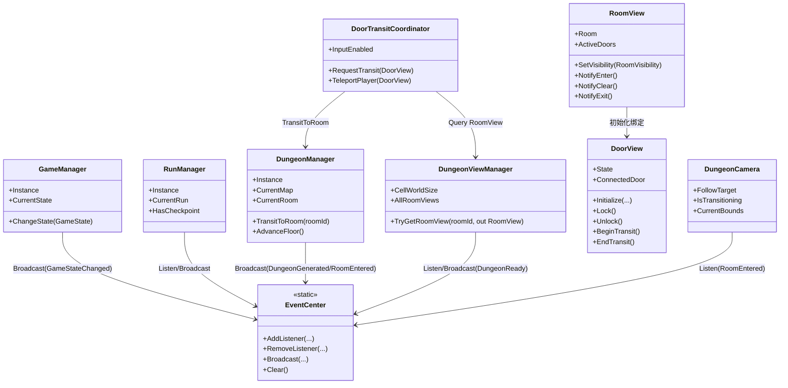
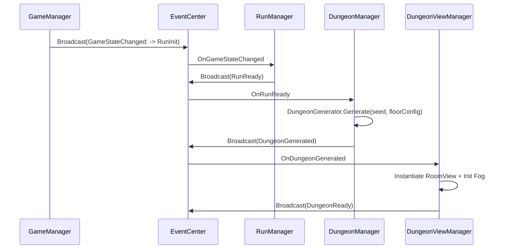
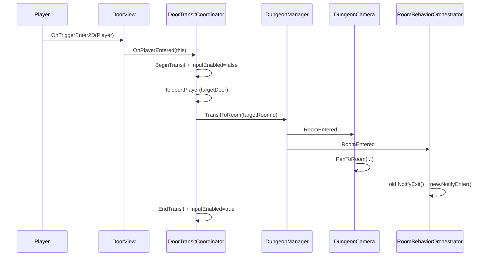

# 2D Roguelike Dungeon

Unity 2D Roguelike 地牢项目（Unity **2022.3.62f3c1**）。

本项目以 **Core / Data / Rogue.Dungeon** 三层脚本架构为基础，围绕事件驱动流程实现：

- 全局状态机与事件中心
- Run 生命周期与持久化
- 可复现（Seeded）地牢生成
- 房间视图实例化与迷雾可见性
- 门交互转场、相机平滑切换、房间行为编排

## 目录

- [项目结构](#项目结构)
- [架构概览](#架构概览)
- [类图](#类图)
- [时序图](#时序图)
- [模块依赖](#模块依赖)
- [核心数据模型](#核心数据模型)
- [地牢生成流水线（10 步）](#地牢生成流水线10-步)
- [API 参考与使用说明](#api-参考与使用说明)
  - [GameManager 状态机](#gamemanager-状态机)
  - [EventCenter 事件中心](#eventcenter-事件中心)
  - [RunManager 与 DungeonManager](#runmanager-与-dungeonmanager)
  - [DungeonViewManager 与 DungeonCamera](#dungeonviewmanager-与-dungeoncamera)
  - [DoorView、DoorTransitCoordinator、RoomBehaviorOrchestrator](#doorviewdoortransitcoordinatorroombehaviororchestrator)

---

## 项目结构

```text
Assets/Scripts/
├── Core/                                  # Core 程序集（无外部依赖）
│   ├── Core.asmdef
│   ├── GameState.cs
│   ├── GameManager.cs
│   ├── Events/
│   │   ├── EventType.cs                   # GameEventType（含 RunReady / DungeonReady 等）
│   │   ├── EventCenter.cs                 # 强类型事件中心
│   │   ├── GameEvents.cs                  # 通用 gameplay 事件 payload
│   │   └── DungeonReadyEvent.cs           # DungeonReady payload
│   └── Pool/
│       ├── IPoolable.cs
│       └── ObjectPool.cs
│
├── Data/                                  # Data 程序集（引用 Core）
│   ├── Data.asmdef
│   ├── SerializableKeyValue.cs
│   ├── Config/
│   │   └── IConfigData.cs
│   ├── Runtime/
│   │   ├── RunState.cs
│   │   ├── RunReadyEvent.cs
│   │   └── RunManager.cs
│   └── Save/
│       ├── ISaveData.cs
│       ├── MetaProgressSave.cs
│       └── SaveManager.cs
│
├── Rogue/Dungeon/                         # Rogue.Dungeon 程序集（引用 Core + Data）
│   ├── Rogue.Dungeon.asmdef
│   ├── DungeonEvents.cs
│   ├── DungeonManager.cs
│   ├── Data/
│   │   ├── Direction.cs / DoorSlot.cs
│   │   ├── RoomShape.cs / RoomType.cs
│   │   ├── RoomTemplateSO.cs
│   │   └── FloorConfigSO.cs
│   ├── Runtime/
│   │   ├── DungeonMap.cs
│   │   ├── RoomInstance.cs
│   │   └── DoorConnection.cs
│   ├── Generation/
│   │   ├── DungeonGenerator.cs
│   │   ├── FootprintBuilder.cs / SpanningTreeBuilder.cs
│   │   ├── RoomMerger.cs / SpecialRoomAssigner.cs
│   │   ├── TemplateSelector.cs / SeededRandom.cs
│   │   └── ...
│   └── View/
│       ├── DungeonViewManager.cs
│       ├── RoomView.cs / DoorView.cs / DoorState.cs
│       ├── DoorTransitCoordinator.cs
│       ├── DungeonCamera.cs
│       ├── RoomBehaviorOrchestrator.cs
│       ├── RoomBehaviors/
│       │   ├── IRoomBehavior.cs
│       │   ├── StartRoomBehavior.cs
│       │   ├── NormalRoomBehavior.cs
│       │   └── BossRoomBehavior.cs
│       ├── SimpleFogController.cs / IRoomFogController.cs
│       └── SpawnPoint.cs / SpawnType.cs / ISpawnPointProvider.cs
│
├── Debug/                                 # 调试脚本（PlayMode 快速验证）
│   ├── DebugAutoStart.cs
│   ├── DebugRuntimeInstaller.cs
│   ├── RoomClearDebugProbe.cs
│   └── ...
│
└── UI/
    └── StartPanel.cs
```

---

## 架构概览

### 分层职责

| 层级 | 核心职责 | 关键类型 |
|------|----------|----------|
| **Core** | 游戏状态切换、事件总线、对象池 | `GameManager`, `EventCenter`, `ObjectPool` |
| **Data** | Run 生命周期、存档与运行态数据 | `RunManager`, `RunState`, `SaveManager` |
| **Rogue.Dungeon** | 地牢生成、地图运行态、房间视图与转场 | `DungeonManager`, `DungeonGenerator`, `DungeonViewManager`, `DoorTransitCoordinator` |

### 运行主链路

`GameManager(ChangeState)`  
→ `RunManager(监听 GameStateChanged)`  
→ `RunReady`  
→ `DungeonManager.Generate`  
→ `DungeonGenerated`  
→ `DungeonViewManager` 实例化  
→ `DungeonReady`  
→ 门/相机/房间行为系统进入工作态。

---

## 类图



---

## 时序图

### 1) Run 初始化到地牢可进入



### 2) 门触发转场到新房间



---

## 模块依赖


依赖约束：

1. `Core` 不引用 `Data` 与 `Rogue.Dungeon`
2. `Data` 不引用 `Rogue.Dungeon`
3. 地牢相关逻辑集中在 `Rogue.Dungeon`

---

## 核心数据模型

### RunState（单局运行态）

- 关键字段：`RunId`, `Seed`, `FloorIndex`, `RoomIndex`, `ElapsedTime`, `CurrentHP`
- 集合字段：`ActiveBuffIds`, `Inventory(List<SerializableKeyValue<string,int>>)`

### DungeonMap（地牢运行态地图）

- `StartRoomId`, `BossRoomId`, `AllRooms`
- `GetRoom(id)` 与 `GetConnectedRoom(roomId, doorSlot)` 快速查询
- 由 `DungeonMap.Build(...)` 从生成节点构建最终房间与门连接

### RoomInstance（房间实例）

- 不可变拓扑：`Id`, `Type`, `Shape`, `GridPosition`, `Cells`, `Template`, `Doors`
- 可变运行标记：`Visited`, `Cleared`

---

## 地牢生成流水线（10 步）

`DungeonGenerator.Generate(seed, config)` 主流程：

| 步骤 | 说明 |
|------|------|
| 1 | 校验 `FloorConfigSO` |
| 2 | 派生布局 RNG 与内容 RNG |
| 3 | 随机选择对角锚点方案（Start/Boss） |
| 4 | 通过多源 BFS 构建 footprint |
| 5 | 用方向偏置 DFS 构建生成树 |
| 6 | 合并 Boss 房并约束单连接 |
| 7 | 查找主路径并分配特殊房（Elite/Shop/Event） |
| 8 | 普通房按权重与合并率执行形状合并 |
| 9 | 模板分配（`TemplateSelector`） |
| 10 | `DungeonMap.Build` 生成最终运行态地图 |

可复现性基础：

- 主 seed 来源于 `RunState.Seed`
- `SeededRandom.Hash(seed, "layout"/"content")` 保证子流程可重放

---

## API 参考与使用说明

### GameManager 状态机

```csharp
// 合法迁移示例：Boot -> Hub -> RunInit
GameManager.Instance.ChangeState(GameState.Hub);
GameManager.Instance.ChangeState(GameState.RunInit);

// 读取状态
var current = GameManager.Instance.CurrentState;
```

说明：

- `ChangeState` 是唯一状态入口
- 非法迁移仅记录 `LogWarning`，不会抛异常中断流程

---

### EventCenter 事件中心

```csharp
using RogueDungeon.Core.Events;

EventCenter.AddListener<RoomEnteredEvent>(GameEventType.RoomEntered, OnRoomEntered);
EventCenter.RemoveListener<RoomEnteredEvent>(GameEventType.RoomEntered, OnRoomEntered);

void OnRoomEntered(RoomEnteredEvent evt) { /* ... */ }

EventCenter.Broadcast(GameEventType.RoomCleared, new RoomClearedEvent
{
    RoomId = "room_2_3",
    ElapsedTime = 18.5f
});
```

说明：

- 同一 `GameEventType` 应保持一致的委托签名
- 推荐生命周期：`OnEnable` 订阅、`OnDisable` 退订

---

### RunManager 与 DungeonManager

```csharp
// RunManager：读取当前 Run
var run = RunManager.Instance.CurrentRun;

// DungeonManager：读取地图与当前房间
var map = DungeonManager.Instance.CurrentMap;
var room = DungeonManager.Instance.CurrentRoom;

// 手动切换房间（通常由 DoorTransitCoordinator 调用）
DungeonManager.Instance.TransitToRoom("room_1_2");
```

说明：

- `RunManager` 在 `RunInit` 进入时创建/恢复 Run，并广播 `RunReady`
- `DungeonManager` 在 `RunReady` 后生成地图并广播 `DungeonGenerated`
- `AdvanceFloor()` 用于层推进并触发新地牢生成

---

### DungeonViewManager 与 DungeonCamera

```csharp
// 查询房间视图
if (dungeonViewManager.TryGetRoomView(roomId, out var roomView))
{
    roomView.SetVisibility(RoomVisibility.Revealed);
}

// 读取运行时 CellWorldSize（由 Inspector 驱动）
int cellSize = DungeonViewManager.CellWorldSize;
```

说明：

- `DungeonViewManager` 负责“清旧 + 全量实例化 + 初始迷雾 + DungeonReady 广播”
- `DungeonCamera` 在 `RoomEntered` 时平滑切换；平时跟随并钳制在当前房间 AABB

---

### DoorView、DoorTransitCoordinator、RoomBehaviorOrchestrator

```csharp
// DoorView 状态转换
doorView.Unlock();
doorView.BeginTransit();
doorView.EndTransit();

// DoorTransitCoordinator 全局输入门控
bool canMove = DoorTransitCoordinator.InputEnabled;
```

说明：

- `DoorView` 仅在 `Unlocked` 且触发者为 `Player` 时发出 `OnPlayerEntered`
- `DoorTransitCoordinator` 负责防重入、门连接匹配、玩家落点计算、相机等待与输入恢复
- 玩家落点规则：
  1. 优先 `DoorTrigger Collider2D.bounds` 内缘锚点
  2. 回退 `targetDoor.transform.position`
  3. 偏移距离 `d = max(_entryOffsetDistance, 0.1f)`，方向为目标门朝向反向（房间内侧）
- `RoomBehaviorOrchestrator` 统一调度 `NotifyExit/NotifyEnter/NotifyClear`，避免行为散落在多组件
